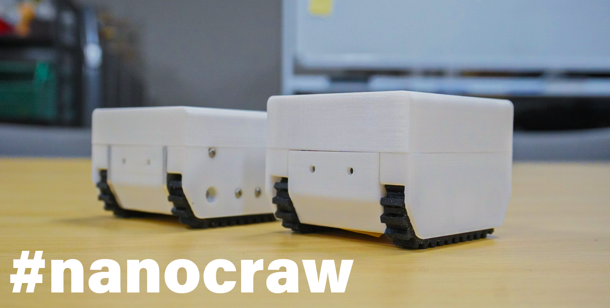

# nanocraw controller   
This is a ROS package for controlling the nanocraw, and this package is based on ROS1. The nanocraw is a palm-sized mobile robot. This robot is equipped with an arduino-compatible microcontroller (M5 Stamp), which communicates between ROS1 and the microcontroller via rosserial.



# Dependence packages   
[ROS]   
- ros1 noetic   
- rosserial
- rosserial_arduino
- Geometry_msgs/Joy   

[Arduino]   
- pololu motoron-arduino   
> https://github.com/pololu/motoron-arduino   

# Install 
## Setting up this package
1. Getting Packages  
    Move into the directory that manages the source for the ros1 package (e.g. `~/catkin_ws/src/`) and clone the nanocraw_ctrl package.  
    ```
    git clone git@github.com:110kazuki/nanocraw_ctrl.git
    ```

2. Installing the dependent packages  
    ```
    $ sudo apt install -y ros-noetic-joy ros-noetic-rosserial ros-noetic-rosserial-arduino
    ```
3. Building this package
    Move into the catkin workspace and build this package.
    ```
    $ catkin_make --only-pkg-with-deps nanocraw_ctrl
    ```

## Setting up the nanocraw
1. Building message headers for Arduino  
    Create message headers for arduino using the Rosserial_arduino package.  

    Terminal①
    ```
    roscore
    ````
    
    Run the rosserial_arduino/make_libraries.py node in the Arduino ide library directory(e.g. `~/Arduino/libraries/`).  
    Terminal ②  
    ```
    rosrun rosserial_arduino make_libraries.py .
    ```

2. Modifying the arduino sketch  
    The sketch to control the nanocraw is [arduino/nancraw_driver/nancraw_driver.ino](arduino/nancraw_driver/nancraw_driver.ino).
    The following modifications are required to connect the robot to the specified WiFi network and perform teleoperation.
    - SSID to connect to  
    - Password for SSID  
    - IP address of the host (where roscore is running)  

3. Building the sketch and writing it in m5 stamp  
    You must have installed the board definition of m5 stamp in arduino ide. See below for details.
    > https://docs.m5stack.com/en/quick_start/stamp_pico/arduino


# Usage  

Terminal ①  
```
$ roscore
```

Terminal ②  
```
rosrun joy joy_node
```

Terminal ③  
```
rosrun nanocraw_ctrl scripts/joycon_ope.py
```

Terminal ④
```
rosrun rosserial_python serial_node.py tcp
```


